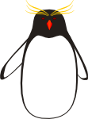

eudyptes
========



**eudyptes** is new generation social platform soon to be running on [fan-club-penguin.cz](http://fan-club-penguin.cz).

### Installation

HTTP Server (Apache), PHP, MariaDB (MySQL), Composer, NPM and gulp will be required. First you’ll have to install dependencies and then build client files.


```
composer install
npm install
gulp
```

Server should also have right to write into *temp* and *log* directories. Finally you’ll have to set the database in *app/config/config.local.neon* (see *config.local.neon.default*) and also import SQL to your database.
